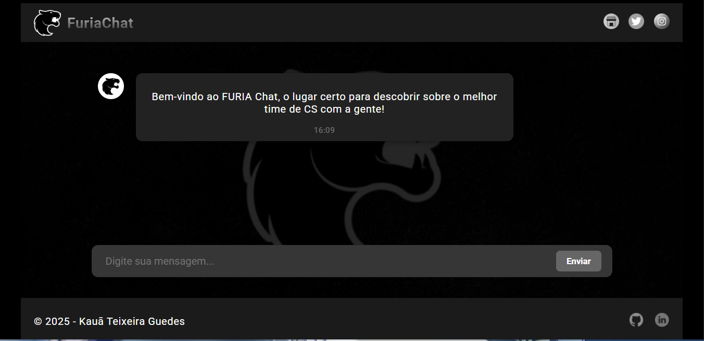
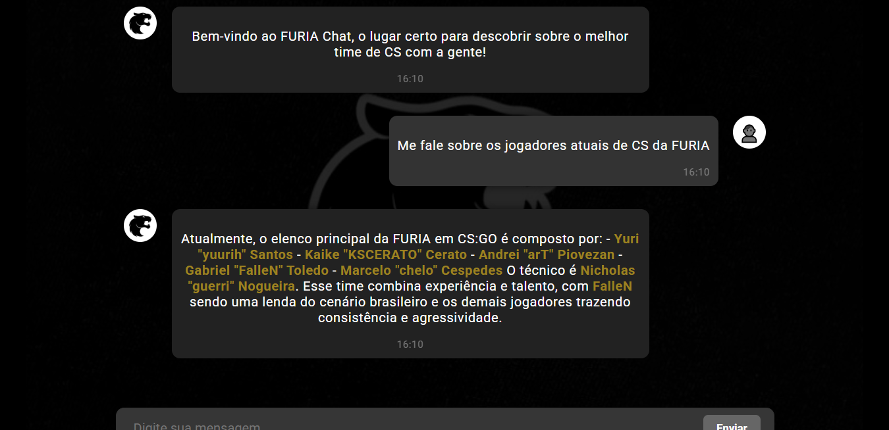

## 🎮 Foco em eSports da FURIA

O bot tem como **foco principal o time de CS:GO da FURIA**, oferecendo:

- Informações sobre **jogadores da equipe** 🎯.
- **Datas de jogos** e campeonatos em que a FURIA está participando 📅.
- **Histórico de títulos** da FURIA no CS 🏆.

## 🚀 Tecnologias Utilizadas

- **React** ⚛️: Biblioteca JavaScript para construção de interfaces.
- **Vite** ⚡: Ferramenta de build ultra-rápida para projetos.
- **JavaScript** 🧑‍💻: Linguagem principal para lógica e interação dos componentes.
- **CSS** 🎨: Estilização modular com responsividade e personalização.
- **OpenRouter + DeepSeek API** 🤖

## 📁 Estrutura do Projeto

- **furia-backend/index.js**: Arquivo principal do servidor Express.
- **furia-bot/src/components/ChatBox.jsx**: Componente principal do chat.
- **furia-bot/src/App.jsx**: Componente raiz da aplicação React.
- **furia-bot/src/index.css**: Estilos base da interface.
- **furia-bot/public/index.html**: HTML principal do front-end.
- **vite.config.js**: Configuração do projeto com Vite.


---

## 🛠️ Como Executar o Projeto

1. **Clone o repositório:**

```bash
git clone https://github.com/KauaTGuedes/furia-chatbot.git
```

2. **Instale as dependências (frontend e backend):**

```bash
cd furia-chatbot/furia-bot
npm install

cd ../furia-backend
npm install
```

3. **Inicie o back-end:**

```bash
cd furia-backend
node index.js
```

4. **Inicie o front-end:**

```bash
cd ../furia-bot
npm run dev
```

---

## 🤖 Integração com API de IA

A IA que responde no chat é baseada na **DeepSeek API**, acessada via [OpenRouter](https://openrouter.ai/), uma plataforma que fornece diversas API's.

## 🤳 prints
## 🤳 Prints

|  |  |
|:---------------------:|:------------------:|


